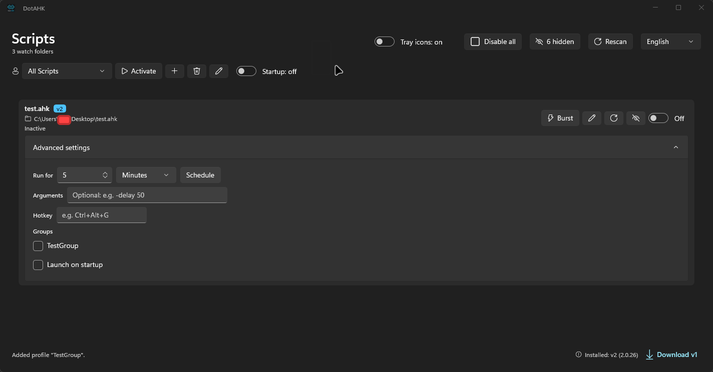

<div align="center">

# 🚀 DotAHK

### Your AutoHotkey scripts, finally organized — **one launchpad, zero tray clutter.**

A modern, minimalist AutoHotkey script manager for Windows, built with
**WinUI 3 (Windows App SDK)** and **C#**. Discover every `.ahk` script in your
folders, launch it with the right interpreter, group scripts into profiles, and
control each one from a single, clean window.

[](LICENSE)
[](../../releases)
[](https://dotnet.microsoft.com/download/dotnet/8.0)
[](#-requirements)
[](#-architecture)
[](#-contributing)

</div>

---

## 📖 What is DotAHK?

**AutoHotkey** is an incredibly powerful automation tool — but once you have a
dozen scripts scattered across `Documents`, the `Desktop` and random project
folders, keeping track of them means remembering which files exist, which
interpreter each one needs (`v1` or `v2`), and which ones are still running in the
background.

**DotAHK eliminates all of that.**

It scans the folders you choose, shows every script in one list, and lets you
start, stop, group and automate them with the mouse. Scripts are still executed by
the official AutoHotkey interpreter you already have installed — so your existing
scripts run exactly as before.

> **DotAHK does not bundle AutoHotkey.** It discovers the v1 and v2 interpreters
> already installed on your machine, and it never modifies your script files.

---

## 📸 Screenshots

### Main window — every script in one place

<p align="center">
  
</p>

---

## ✨ Key Features

<table>
<tr>
<td width="50%" valign="top">

### 🖥️ Process Isolation (PID Tracking)
- **Exact PID control** — each script is launched through its resolved
  interpreter and its process ID is recorded.
- **Stop only what you mean to** — killing one script never touches the others.
- **Burst mode** — run a script for a fixed **10-second** window, then auto-stop.
- **Runaway detection** — sustained high CPU usage is flagged so a stuck loop
  does not go unnoticed.
- **Clean exit** — every process DotAHK started is terminated when the app exits.

### 🕵️ Tray Hijacking (`#NoTrayIcon`)
- **One master tray icon** — running scripts no longer each add their own icon.
- **Non-destructive** — a temporary execution copy gets `#NoTrayIcon`
  prepended; **your original file is never modified**.
- **Encoding-safe** — the copy preserves the source's BOM and bytes, so both
  v1 (ANSI/UTF-8) and v2 (UTF-8) scripts stay valid.
- **Respectful** — skipped entirely when a script already sets `#NoTrayIcon`.

</td>
<td width="50%" valign="top">

### 🧩 Environment Profiles (Many-to-Many)
- **Group your setup** — "Gaming", "Dev", "Work"… whatever you need.
- **Many-to-many tagging** — a script can belong to several profiles at once.
- **Switch context fast** — activating a profile launches its scripts and stops
  the tracked ones that no longer belong.
- **Saved instantly** — every change is persisted to `settings.json`.

### 🧠 Smart Version Detection (v1 / v2)
- **Finds your installs** — reads the AutoHotkey registry keys (64-bit, 32-bit
  and per-user) plus the standard `Program Files` locations.
- **Picks the right interpreter** — inspects each script's `#Requires` directive;
  v2 is preferred when a script does not declare a version.

### ⌨️ Hotkey Awareness
- **Native hotkeys detected** — DotAHK scans each script and lists the AHK
  hotkeys it defines (for example `^!a`, `F1`).
- **Human-readable form** — converts between `Ctrl+Alt+G` text and the internal
  gesture representation.
- **Global toggles** — assign a system-wide hotkey per script to toggle it on/off.

### 🌍 Multilingual Support
- **4 languages** — English, Spanish, Russian, German (switchable live).
- **OS-aware** — detects your Windows display language on first launch.

</td>
</tr>
</table>

---

## 🧩 Run Modes & Automation

Choose how each script should run — or let a global hotkey toggle it for you.

| Mode | Behaviour | Best for |
|---|---|---|
| **▶️ Persistent** | Runs until you toggle it off. | Long-lived utilities, remappers |
| **⚡ Burst** | Runs for a fixed **10 seconds**, then stops automatically. | Quick one-shot actions |
| **⏱️ Scheduled** | Runs for a user-defined duration, then stops automatically. | Timed tasks |
| **🔄 Auto-start** | Launched automatically when DotAHK boots. | Your everyday setup |
| **⌨️ Global hotkey** | A system-wide shortcut toggles the script on/off. | Instant access anywhere |

---

## 🛡️ Elevation & Silent Background Startup

DotAHK can manage scripts that require administrator rights and start itself
silently at sign-in — without ever flashing a window on screen.

### 🔐 Admin Auto-Elevation
- **One elevated tracker** — instead of elevating each script, the whole DotAHK
  process can relaunch itself through UAC, so a single tracker can watch and stop
  every child process (no UAC blindness).
- **Opt-in preference** — the gear menu's **"Always run as administrator"** toggle
  requests elevation (UAC) on every launch.
- **Manual elevation** — the **"Activate Admin"** button relaunches DotAHK elevated
  on demand.
- **Elevated-script warnings** — scripts that request elevation are flagged in the
  UI with a warning icon explaining that they must be started while DotAHK is in
  Admin mode, otherwise the toggle will appear to switch off due to Windows security.

### 🗓️ Windows Task Scheduler Integration
- **In-app registration** — a toggle in the settings flyout registers DotAHK with
  the Windows Task Scheduler (task name `DotAHK_Startup`), gated behind
  administrator rights (the control is disabled with an explanatory tooltip while
  unelevated).
- **Elevated sign-in start** — the task runs at logon with run level
  **HighestAvailable**, launching DotAHK with the `--minimized` flag.
- **Silent, flash-free background start** — on a `--minimized` launch DotAHK hides
  its native window before the UI thread renders and boots straight into the
  notification area, so the window never flashes on screen.
- **Daemon-safe by design** — the task is created from an **XML definition**
  (`schtasks /create /xml`) that explicitly disables the Task Scheduler defaults
  which would otherwise kill a background daemon:
  - `<DisallowStartIfOnBatteries>false</DisallowStartIfOnBatteries>`
  - `<StopIfGoingOnBatteries>false</StopIfGoingOnBatteries>`
  - `<ExecutionTimeLimit>PT0S</ExecutionTimeLimit>` (no time limit)

  This bypasses the usual ~3-day execution cap and the battery-power restriction.

---

## 📋 Requirements

| Component | Why you need it | Link |
|---|---|---|
| **Windows 10 (1809+) / 11** (x64, x86, ARM64) | The app is a WinUI 3 desktop application | — |
| **.NET 8 Desktop Runtime** | To run the compiled app (framework-dependent build) | [Download](https://dotnet.microsoft.com/download/dotnet/8.0) |
| **Windows App Runtime** (Windows App SDK) | Required by the unpackaged WinUI 3 app at runtime | [Download](https://learn.microsoft.com/windows/apps/windows-app-sdk/downloads) |
| **AutoHotkey v1 and/or v2** | The interpreter that actually runs your scripts | [Download](https://www.autohotkey.com/) |

> 💡 If you build from source you need the **.NET 8 SDK** (the .NET 8 Desktop
> Runtime alone is not enough).

---

## 📥 Installation

### Option A — Ready-to-use executable *(recommended)*

Grab the pre-built `DotAHK.exe` from the link in the
[Releases](../../releases) page. It is a **framework-dependent** build, so make
sure the **.NET 8 Desktop Runtime** and the **Windows App Runtime** listed in
[Requirements](#-requirements) are installed first, then run it.

### Option B — Build from source

```cmd
git clone https://github.com/AIMDYCK/DotAHK.git
cd DotAHK
dotnet restore DotAHK.sln
dotnet build DotAHK.sln -c Debug
dotnet run --project src\DotAHK\DotAHK.csproj -c Debug
```

### Option C — Produce a portable, self-contained single-file executable

```cmd
dotnet publish src\DotAHK\DotAHK.csproj -c Release -r win-x64 ^
  --self-contained true -p:PublishSingleFile=true ^
  -p:IncludeNativeLibrariesForSelfExtract=true ^
  -p:WindowsAppSDKSelfContained=true -p:EnableMsixTooling=true
```

The result is a single, dependency-free `DotAHK.exe` — no .NET or Windows App
Runtime installation is required on the target machine — produced in:

```
src\DotAHK\bin\Release\net8.0-windows10.0.26100.0\win-x64\publish\
```

> ⚠️ Keep the accompanying `DotAHK.pri` file next to the executable — WinUI 3
> loads it for the app's compiled XAML resources.

### First run

1. Launch DotAHK — the onboarding flow opens on first start.
2. Choose the folders to watch (your scripts are **never** moved or edited).
3. Make sure AutoHotkey v1 and/or v2 is installed so interpreters can be found.
4. Start, stop and group your scripts from the main window. Done. 🎉

---

## 🏗️ Architecture

DotAHK follows the **MVVM** pattern with a small, dependency-free composition
root that builds the service graph on a background thread at startup.

```
┌──────────────────────────────────────────────┐
│                 App.xaml.cs                  │
│   single instance · startup trace · exit hook │
└───────────────────────┬──────────────────────┘
                        │
               ┌────────▼────────┐
               │   AppServices   │   composition root
               │ (background init)│
               └────────┬────────┘
                        │
         ┌──────────────┼───────────────┐
         │              │               │
    ┌────▼────┐   ┌─────▼─────┐   ┌─────▼──────┐
    │  Views  │◄─►│ ViewModels│◄─►│  Services  │
    │ (XAML)  │   │  (MVVM)   │   │(interfaces)│
    └─────────┘   └───────────┘   └─────┬──────┘
                                        │
          ┌───────────┬─────────────────┼───────────────┐
          │           │                 │               │
     ┌────▼────┐ ┌────▼─────┐  ┌────────▼──────┐ ┌──────▼──────┐
     │  AHK    │ │  Script  │  │ settings.json │ │ startup.log │
     │ v1 / v2 │ │processes │  │(%LOCALAPPDATA%)│ │(diagnostics)│
     └─────────┘ └──────────┘  └───────────────┘ └─────────────┘
```

### Project structure

```
DotAHK/
├── src/
│   └── DotAHK/
│       ├── App.xaml(.cs)             # Startup, single-instance, exit cleanup
│       ├── AppServices.cs            # Composition root (background init)
│       ├── MainWindow.xaml(.cs)      # Main window + tray integration
│       ├── MainPage.xaml(.cs)        # Primary script-management UI
│       ├── OnboardingPage.xaml(.cs)  # First-run experience
│       ├── LoadingPage.xaml(.cs)     # Startup / loading screen
│       ├── Models/                   # Scripts, installations, profiles, settings
│       ├── Services/                 # Core logic (behind interfaces)
│       │   ├── AhkInstallationService.cs  # Registry + path detection (v1/v2)
│       │   ├── ScriptScanner.cs           # Watch-folder enumeration
│       │   ├── ProcessTracker.cs          # PID tracking, burst mode, telemetry
│       │   ├── TempScriptService.cs       # #NoTrayIcon execution copies
│       │   ├── ProfileService.cs          # Environment profiles (many-to-many)
│       │   ├── HotkeyParser.cs            # AHK hotkey extraction
│       │   ├── AdminElevationService.cs   # UAC self-elevation (runas)
│       │   ├── StartupTaskService.cs      # Task Scheduler startup (XML)
│       │   └── LocalizationService.cs     # Runtime .resw catalogs
│       ├── ViewModels/               # MVVM view models
│       ├── Converters/               # XAML value converters
│       ├── Strings/<lang>/Resources.resw  # en-US, es-ES, ru-RU, de-DE
│       └── Assets/                   # Application icons, logos and splash images
├── tools/                            # Icon-generation PowerShell scripts
├── DotAHK.sln
├── LICENSE
└── README.md
```

---

## 🌍 Localization

| Code | Language |
|---|---|
| `en-US` | English *(default / neutral)* |
| `es-ES` | Spanish |
| `ru-RU` | Russian |
| `de-DE` | German |

Translations live in `Strings/<lang>/Resources.resw` and are loaded at runtime —
**no restart required**.

---

## 🔒 Privacy & Security

- **No personal data in the repository.** All user-specific values (watch
  folders, script paths, profiles, arguments, hotkeys) live in
  `%LOCALAPPDATA%\DotAHK\settings.json`, which is excluded from version control.
- **No hardcoded paths.** Locations are resolved through
  `Environment.GetFolderPath(...)` and `AppContext.BaseDirectory` exclusively.
- **Your scripts are never modified.** Tray hijacking works on a temporary copy
  under `%LOCALAPPDATA%\DotAHK\Temp`, which is deleted when the run ends.
- **Precise process control.** DotAHK only ever terminates the specific PIDs it
  started; it never kills unrelated AutoHotkey processes.
- **Local diagnostics only.** `startup.log` is written locally for
  troubleshooting and is never uploaded anywhere.

---

## 🤝 Contributing

Contributions are welcome! Whether it's a bug report, a documentation fix or a new
feature — you are welcome.

- 🐛 Found a bug? Open an issue describing the problem and how to reproduce it.
- ✨ Have an idea? Open an issue describing the feature you would like to see.
- 🔧 Submitting code? Fork the repo, create a focused branch, build, and verify
  your change manually before opening a pull request.

There is currently **no automated test suite and no CI pipeline**, so please
build and manually exercise the affected feature before submitting:

```cmd
dotnet build DotAHK.sln -c Debug
dotnet run --project src\DotAHK\DotAHK.csproj -c Debug
```

---

## ☕ Support the Project

DotAHK is **free and open source** (MIT). If it saved you time, the simplest way
to support it is to spread the word:

> ### ⭐ Star the repository and share it with other AutoHotkey users!

Every star ⭐ and share helps more than you think. Thank you!

---

## 🛠️ Credits & Development

**DotAHK** was designed and developed by **AIMDYCK**.

This project was built and iterated using an AI-assisted development workflow:

- **Visual Studio Code** — the primary editor.
- **ZooCode** — the AI coding agent used to build and iterate the application.
- **Supermaven** — AI-powered code completion that accelerated day-to-day coding.
- **DeepSeek API** — the large language model powering the workflow.

A heartfelt thank you to the open source community behind **AutoHotkey**,
**WinUI 3** and the **Windows App SDK**, without whom this project would not exist.

---

## 📄 License

Released under the [MIT License](LICENSE).

**AutoHotkey**, the **Windows App SDK** and **CommunityToolkit.Mvvm** are
independent projects with their own licenses and are not affiliated with DotAHK.

<div align="center">

**Made with ❤️ for the AutoHotkey community**

⭐ If you like this project, don't forget to star the repository! ⭐

</div>
